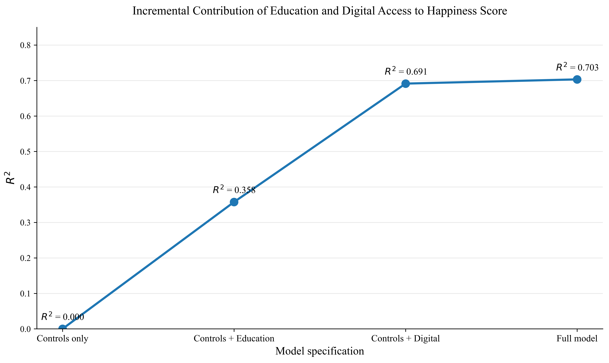

# Education, Digital Access, and Happiness

Cross-country analysis of how education and digital connectivity relate to national happiness scores.

The notebook builds a country-year dataset, checks multicollinearity and regression assumptions, and compares OLS, ridge, lasso, elastic net, random forest, gradient boosting, and PCA regression.



## Results

The modeling table contains 615 country-year observations. Lasso produced the strongest held-out result among the evaluated models.

| Model | Test RMSE | Test R² |
|---|---:|---:|
| Lasso | 0.643 | 0.769 |
| Ridge | 0.648 | 0.765 |
| Elastic net | 0.650 | 0.764 |
| PCA regression | 0.655 | 0.760 |
| Gradient boosting | 0.660 | 0.757 |
| Random forest | 0.717 | 0.713 |
| OLS | 0.731 | 0.701 |

The nested-model comparison found that digital-access variables added substantial explanatory power beyond the control model. Education variables also added statistically significant information after digital variables were included. These are observational associations and should not be interpreted as causal effects.

## Repository contents

- `notebooks/analysis.ipynb` - data preparation, analysis, modeling, diagnostics, and figures
- `data/` - source extracts and prepared modeling datasets
- `figures/` - selected figures
- `reports/final-report.pdf` - submitted project report

## Run

```bash
python -m pip install -r requirements.txt
```

Open `notebooks/analysis.ipynb` and run the cells in order.

## Data and limitations

The analysis combines World Happiness Report files with education, internet-access, and mobile-connectivity data. Confirm each source's redistribution terms before reuse.

- Country-year observations are not necessarily independent across time.
- Several connectivity measures overlap, creating multicollinearity concerns.
- Results describe associations and do not establish causality.

## Attribution

Academic project completed for Georgia Tech OMS Analytics. The analysis and interpretations are the author's work unless otherwise noted in the report.
